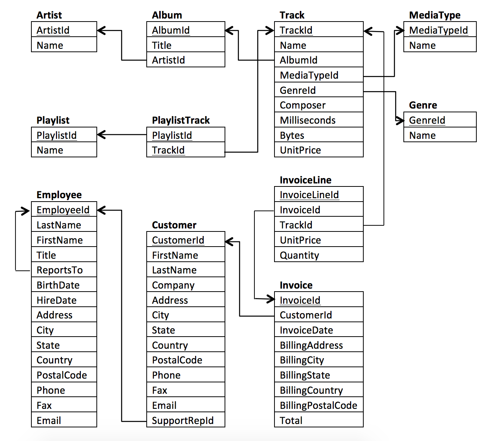
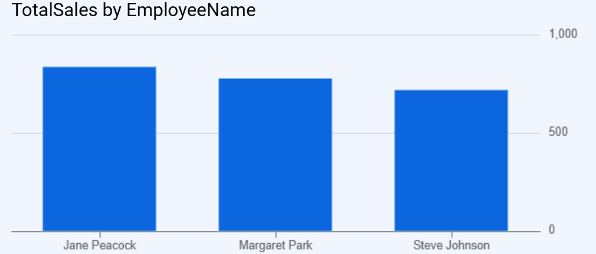
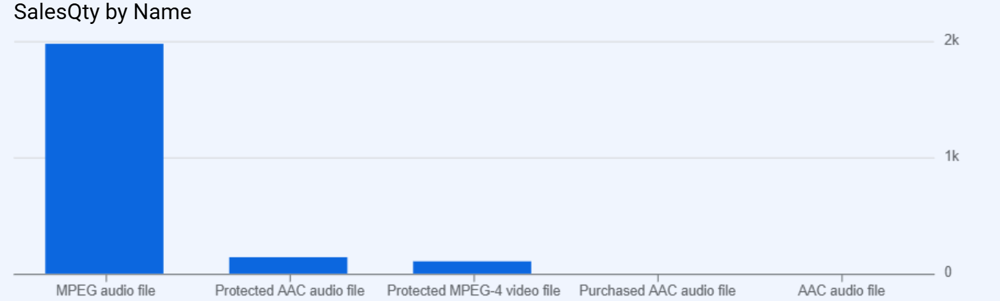
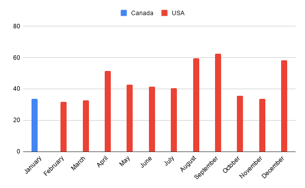
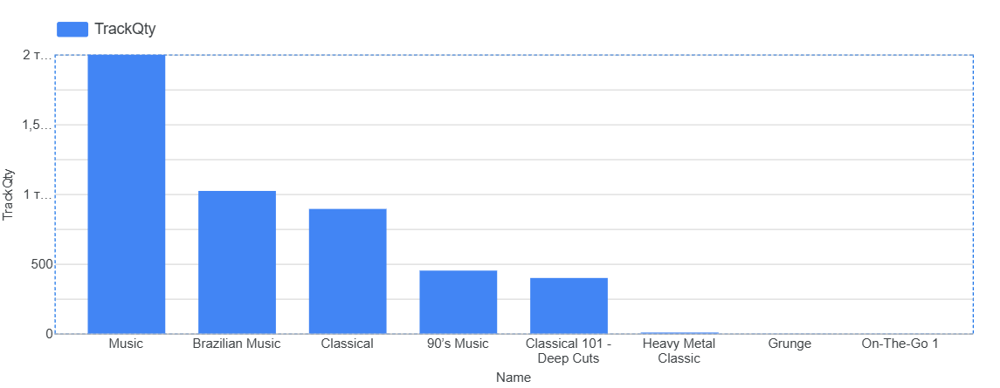

# Chinook Music Store — SQL Analysis (BigQuery)

A SQL-based exploratory analysis of the Chinook digital music store database — looking at revenue trends, customer behavior, genre popularity, employee performance, and the content catalog. Built in **BigQuery**, with results visualized in **Google Sheets** and **Looker Studio**.

## Why this project

I wanted hands-on practice with multi-table joins, CTEs, and per-group aggregations on a realistic relational schema, while also practicing how to turn raw query output into business-readable insights and visuals.

## Dataset & Schema

Chinook models a digital media store: artists, albums, tracks, genres, media types, playlists, employees, customers, and invoices.



## Tools

- **SQL (BigQuery)** — querying, joins, CTEs, subqueries, conditional aggregation
- **Google Sheets** — pivot tables and charts
- **Looker Studio** — interactive visualizations

## What's in the analysis

The full set of queries ([`chinook_analysis.sql`](chinook_analysis.sql)) is organized into three parts:

1. **Customer & Sales Overview** — revenue by country/city, the highest-spending customer, and outlier track lengths
2. **Genre, Artist & Customer Deep Dive** — rock listeners, top artists by genre, top-earning artist vs. top spender, most popular genre and customer per country
3. **Custom Business Analysis** — four original questions I came up with, each combining a JOIN with an aggregation, paired with a chart and short write-up below

## Highlights

### Which sales reps generate the most revenue?

Joined `Employee → Customer → Invoice` via `SupportRepId`, filtering to `Title = 'Sales Support Agent'` to exclude managers and IT staff (who would otherwise show `NULL` revenue).



Jane Peacock leads with \~$833 in sales, followed by Margaret Park (\~$775) and Steve Johnson (\~$720) — a fairly even spread across the three-person sales team.

### Which media format sells the most?

Joined `MediaType → Track → InvoiceLine` and counted purchased line items per format.



MPEG audio dominates with ~1,976 sales (~98% of all purchases). Every other format (Protected AAC, Protected MPEG-4, Purchased AAC, AAC) is barely visible by comparison — the catalog is overwhelmingly MP3-based.

### Which country generates the most revenue each month?

Built a CTE of revenue by country and month, then joined against the per-month maximum to find the top country for each month.



The USA leads in 11 of 12 months. The one exception is January, where Canada narrowly takes the top spot (~$33.66).

### Which playlists contain the most tracks?

Joined `Playlist → PlaylistTrack` and counted tracks per playlist (shown both with and without empty playlists like *Movies* and *TV Shows*).



*Music* is by far the largest playlist (1,998 tracks), followed by *Brazilian Music* (1,022) and *Classical* (893) — all other playlists are an order of magnitude smaller.

## Repository Structure

```
chinook-sql-analysis/
├── README.md
├── chinook_analysis.sql
└── images/
    ├── q1_employee_sales.png
    ├── q2_mediatype_sales.png
    ├── q3_country_by_month.png
    ├── q4_playlist_sizes.png
    └── schema.png
```
